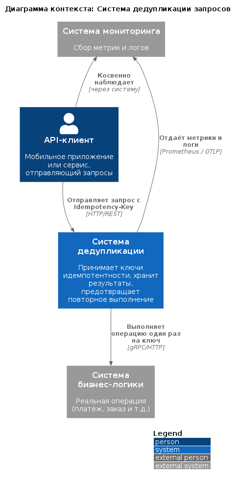
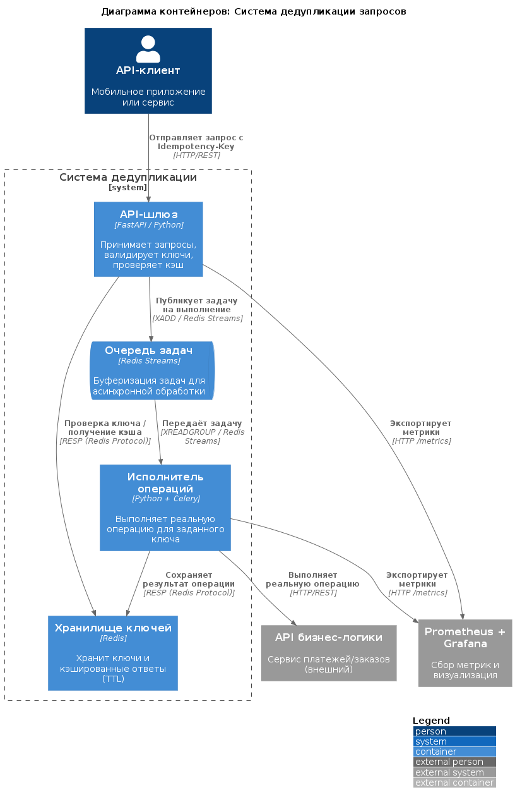
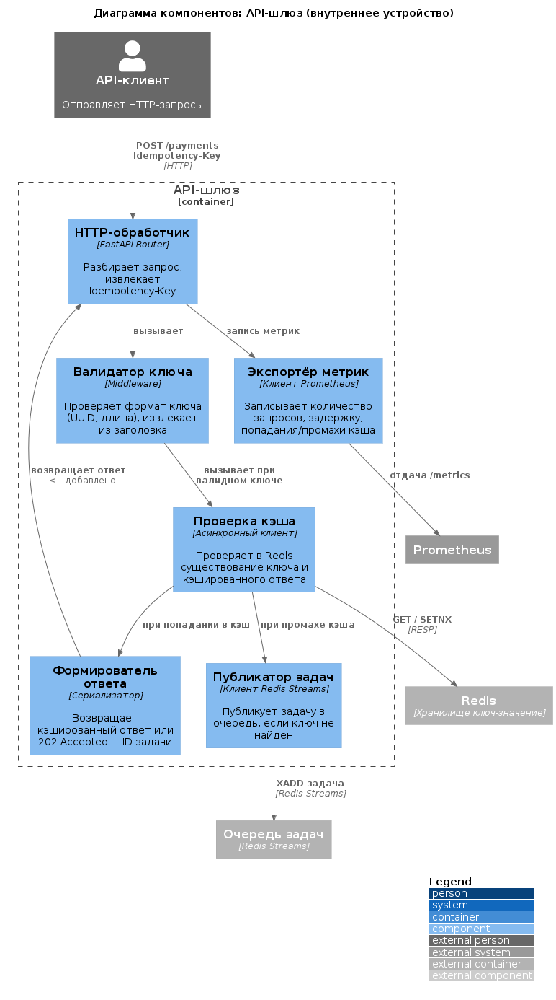

# Практика №1: Архитектурное проектирование системы дедупликации запросов

## Problem Statement (Описание проблемы)

**Система дедупликации запросов** предназначена для разработчиков API, которым необходимо гарантировать идемпотентность операций (платежи, заказы, отправка сообщений).  
Клиент отправляет уникальный ключ (`Idempotency-Key`) вместе с запросом. При первом запросе система выполняет операцию и сохраняет результат. При повторных запросах с тем же ключом система возвращает сохранённый результат без повторного выполнения.  
**Пользователи:** backend-разработчики, интеграторы.  
**Внешние системы:** API бизнес-логики (платежи/заказы), система мониторинга (Prometheus + Grafana), Redis/PostgreSQL для хранения.

---

## Диаграмма 1: Контекст (C1)

[Исходный код PlantUML](diagrams/context.puml)

#### Анализ диаграммы контекста

| Аспект | Что сгенерировал ИИ | Что исправлено вручную | Обоснование исправления |
|--------|---------------------|------------------------|--------------------------|
| Компоновка диаграммы | Стандартная | Добавлен LAYOUT_TOP_DOWN() | Вертикальная компоновка улучшает читаемость |
| Структура кода | Сплошной блок | Разделение на блоки с комментариями | Упрощает понимание и сопровождение кода |
| Описание связи клиент→мониторинг | Только "Косвенно наблюдает" | Добавлено "через систему" в квадратные скобки | Соответствие нотации C4 (технология связи) |
| Форматирование | "Prometheus/OTLP" | "Prometheus / OTLP" | Визуальное улучшение читаемости |

---

## Диаграмма 2: Контейнеры (C2)

[Исходный код PlantUML](diagrams/container.puml)

#### Анализ диаграммы контейнеров

| Аспект | Что сгенерировал ИИ | Что исправлено вручную | Обоснование исправления |
|--------|---------------------|------------------------|--------------------------|
| Хранилище ключей | Один контейнер "Redis / PostgreSQL" | Разделено на Redis (кэш) и PostgreSQL (постоянное хранилище) | Один контейнер не может быть двумя разными СУБД |
| Очередь задач | Отсутствовала | Добавлен отдельный контейнер Redis Streams | Очередь — самостоятельный элемент архитектуры |
| Протокол связи шлюз→хранилище | "Асинхронно/Redis" | "RESP (Redis Protocol)" | Указан конкретный протокол вместо паттерна |
| Протокол связи шлюз→воркер | "Redis Streams / Очередь" | XADD (шлюз→очередь) и XREADGROUP (очередь→воркер) | Разделено на две связи с разными командами Redis |
| Тип воркера | "Фоновый воркер" | "Python + Celery" | Конкретизация технологии для реализации |
| Метрики | Есть, без указания эндпоинта | Добавлен "HTTP /metrics" | Соответствие требованию практики №4 |

## Диаграмма 3: Компоненты API-шлюза (C3)

[Исходный код PlantUML](diagrams/component.puml)

#### Анализ диаграммы компонентов

| Аспект | Что сгенерировал ИИ | Что исправлено вручную | Обоснование исправления |
|--------|---------------------|------------------------|--------------------------|
| API-клиент | Отсутствовал | Добавлен Person_Ext с HTTP-связью к обработчику | Обеспечивает контекст входящих запросов на уровне компонентов |
| Связь формирователь → обработчик | Отсутствовала | Добавлена Rel(формирователь, обработчик, "возвращает ответ") | Замыкает цикл обработки запроса — ответ должен вернуться в обработчик |
| Технология публикатор → очередь | "XADD задача" | "XADD задача", "Redis Streams" | Явное указание технологии в квадратных скобках (нотация C4) |
| Экспорт метрик | Корректный | Оставлен без изменений | ИИ правильно сгенерировал /metrics и связь с Prometheus |

## Вывод о пригодности ИИ для архитектурного проектирования
> **ИИ-ассистенты эффективны для первичной генерации диаграмм C4, особенно на уровне контекста (C1). Однако для уровней C2 и C3 обязательна ручная доработка: разделение технологий, добавление пропущенных компонентов (очереди, БД), уточнение протоколов и замыкание связей.**
>
> **Вывод:** ИИ — мощный инструмент повышения продуктивности, но финальная ответственность за корректность архитектуры лежит на инженере. Наиболее применим ИИ на этапе «быстрого прототипирования», а наименее — на этапе детального проектирования внутренней логики компонентов.

### Рекомендации по использованию ИИ для архитектурного проектирования

1. Всегда указывайте в промпте **нефункциональные требования** (мониторинг, логирование, асинхронность)

2. После генерации проверяйте:
   - Нет ли смешения технологий в одном контейнере
   - Все ли связи имеют конкретные протоколы
   - Добавлена ли легенда (`LAYOUT_WITH_LEGEND()`)
   - Не пропущены ли важные компоненты (очереди, кэши, БД)

3. На уровне C3 обязательно проверяйте **замкнутость логических циклов**

4. Используйте ИИ как **инструмент для ускорения**, но не доверяйте ему финальную проверку