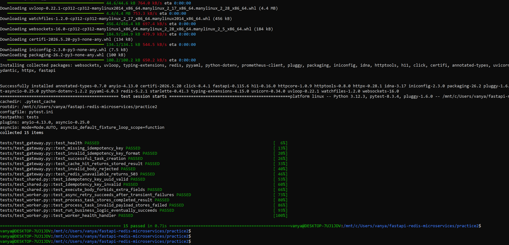
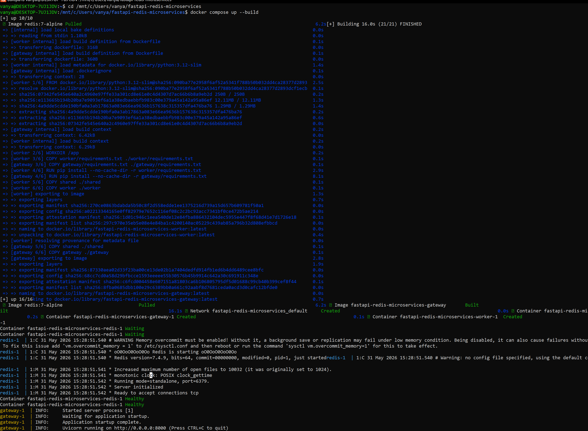

# Отчёт по практике №2

## Ссылка на репозиторий

> **Замените на свою ссылку после `git push`:**
>
> `https://github.com/<username>/fastapi-redis-microservices`

## Использованные ИИ-инструменты

| Инструмент | Назначение |
|------------|------------|
| **Cursor** (Composer / Agent) | Генерация микросервисов, Docker, тестов, README |
| **Claude** (модель в Cursor) | Рефакторинг под ТЗ `practice2/`, retries, отчёт |

## Примеры полезных промптов

1. *«Создай два микросервиса на Python FastAPI: API Gateway с Idempotency-Key и Redis Streams, Worker с задержкой 50–200 мс, prometheus-client, docker-compose, pytest»* — дало рабочий каркас.
2. *«Доделай под practice2: структура services/, retries, тесты для каждого сервиса, PRACTICE2.md»* — привело структуру к требованиям задания.
3. *«Добавь валидацию Pydantic для action enum и обработку 503 при падении Redis»* — уточнило контракт API.

## Оценка доли кода

| Источник | Доля (оценка) |
|----------|----------------|
| Сгенерировано ИИ | ~85% |
| Доработано вручную | ~15% (пути WSL, правки тестов, ссылка на репозиторий, скриншоты) |

## Ошибки и способы исправления

| Проблема | Причина | Решение |
|----------|---------|---------|
| `docker: command not found` в PowerShell | Docker не в PATH Windows | Запуск через **WSL**, где установлен Docker |
| `pip`/pydantic не ставится на хосте | Python **3.14**, нет wheel | Тесты и запуск только в **Docker** (Python 3.12) |
| Предупреждение Redis `Memory overcommit` | Настройки ядра WSL | Для dev можно игнорировать |
| Тест 503 падал | `fail_next_get` срабатывал 1 раз | Флаг `get_always_fails` на все retry |

## Скриншот успешного прохождения автотестов

> **Вставьте скриншот** вывода команды:
>
> ```bash
> cd practice2
> docker compose --profile test run --rm test
> ```
>
> Ожидаемый результат: `15 passed`.



## Схема взаимодействия микросервисов

```
  [Клиент]
      |  POST /execute + Idempotency-Key
      v
  [API Gateway :8000]
      |-- GET result:{key} -----> [Redis]
      |<-- hit: 200 / miss -------|
      |-- XADD tasks:stream -----> [Redis Stream]
      |-- 202 Accepted
      v
  [Worker :9090]
      |-- XREADGROUP (group: workers)
      |-- retry x3 business logic
      |-- SET result:{key}, TTL 1h
      |-- XACK
```

Повторный запрос с тем же ключом обслуживается Gateway из кэша без новой задачи в stream.

## Скриншот логов docker compose up

> **Вставьте скриншот** терминала с строками:
>
> - `redis-1 | Ready to accept connections`
> - `gateway-1 | Uvicorn running on http://0.0.0.0:8000`
> - `worker-1` (контейнер в состоянии running)



## Локальная проверка (чеклист)

- [ ] `docker compose up --build` из `practice2/`
- [ ] `curl http://localhost:8000/health` → `ok`
- [ ] POST `/execute` → 202, затем 200 с тем же ключом
- [ ] `docker compose --profile test run --rm test` → все тесты passed
- [ ] Код запушен в Git, ссылка обновлена в этом файле
