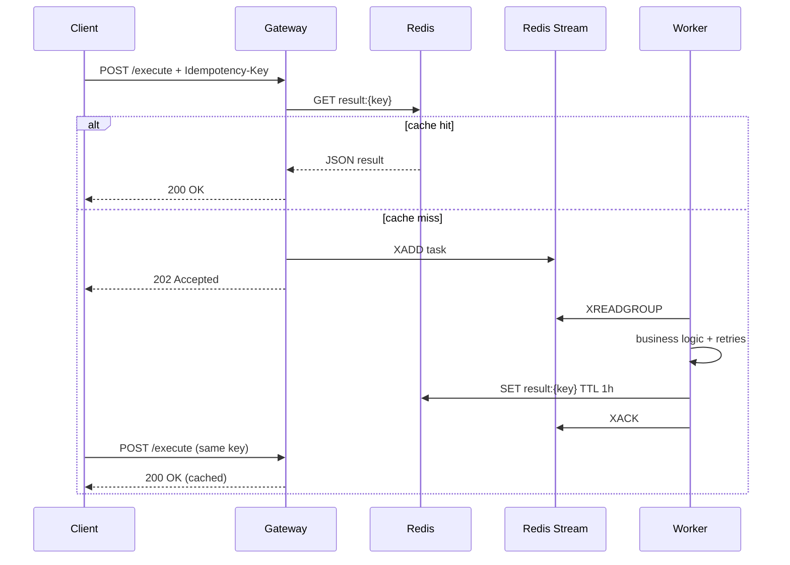

# Practice 2 — Микросервисы с идемпотентностью

Два микросервиса на Python: **API Gateway** (FastAPI) и **Worker** (Redis Streams consumer).

## Архитектура



| Компонент | Порт | Описание |
|-----------|------|----------|
| Gateway | 8000 | REST API, идемпотентность, метрики |
| Worker | 9090 | Обработка очереди, health, метрики |
| Redis | 6379 | Кэш результатов + stream `tasks:stream` |

## Запуск (Docker)

Из каталога `practice2/` (WSL):

```bash
cd /mnt/c/Users/vanya/fastapi-redis-microservices/practice2
docker compose up --build
```

Проверка:

- http://localhost:8000/health
- http://localhost:8000/docs — OpenAPI (Swagger)
- http://localhost:8000/metrics
- http://localhost:9090/health

## Автотесты

### Рекомендуется при проблемах с сетью (WSL, без Docker)

```bash
# один раз в WSL, если venv не создаётся:
sudo apt update && sudo apt install -y python3-venv python3-pip

sed -i 's/\r$//' scripts/run-tests.sh
bash scripts/run-tests.sh
```

Зеркало PyPI (если `pypi.org` таймаутится):

```bash
PIP_INDEX_URL=https://pypi.tuna.tsinghua.edu.cn/simple ./scripts/run-tests.sh
```

### Через Docker

Нужен образ `practice2-gateway` **с pytest** (пересоберите, когда сеть к PyPI есть):

```bash
docker compose build gateway
docker compose --profile test build test    # pip не вызывается
docker compose --profile test run --rm test
```

## API

### `GET /health`

Ответ: `{"status":"ok"}`

### `GET /metrics`

Метрики Prometheus.

### `POST /execute`

| Заголовок | Обязательный | Описание |
|-----------|--------------|----------|
| `Idempotency-Key` | да | UUID v4 или `[a-zA-Z0-9_-]{8,128}` |
| `Content-Type` | да | `application/json` |

**Тело (JSON):**

```json
{
  "action": "process",
  "data": {"value": 42}
}
```

| Поле | Тип | Описание |
|------|-----|----------|
| `action` | `process` \| `validate` \| `ping` | Тип операции (обязательно) |
| `data` | object | Данные задачи, до 4 KB в JSON |

**Ответы:**

| Код | Когда |
|-----|--------|
| 200 | Результат уже в Redis |
| 202 | Задача поставлена в очередь |
| 400 | Нет или неверный `Idempotency-Key` |
| 422 | Невалидное тело |
| 503 | Redis недоступен (после retries) |

### Примеры

**Новая задача (202):**

```bash
curl -X POST http://localhost:8000/execute \
  -H "Content-Type: application/json" \
  -H "Idempotency-Key: 550e8400-e29b-41d4-a716-446655440000" \
  -d '{"action":"process","data":{"value":1}}'
```

**Повтор после обработки worker (200):**

```bash
# тот же Idempotency-Key через ~1 секунду
curl -X POST http://localhost:8000/execute \
  -H "Content-Type: application/json" \
  -H "Idempotency-Key: 550e8400-e29b-41d4-a716-446655440000" \
  -d '{"action":"process","data":{"value":1}}'
```

**Ошибка — нет заголовка (400):**

```bash
curl -X POST http://localhost:8000/execute \
  -H "Content-Type: application/json" \
  -d '{"action":"process","data":{}}'
```

## Надёжность

- **Gateway:** до 3 повторов обращений к Redis при сетевых ошибках; ответ 503 при исчерпании попыток.
- **Worker:** до 3 повторов бизнес-логики при транзиентных сбоях; при окончательной ошибке — `status: failed` в Redis.

## Структура проекта

```
practice2/
├── docker-compose.yml
├── README.md
├── PRACTICE2.md
├── services/
│   ├── gateway/
│   └── worker/
├── shared/
└── tests/
```

## Переменные окружения

| Переменная | По умолчанию | Описание |
|------------|--------------|----------|
| `REDIS_URL` | `redis://localhost:6379/0` | URL Redis |
| `RETRY_MAX_ATTEMPTS` | `3` | Число повторов |
| `RESULT_TTL_SECONDS` | `3600` | TTL кэша результата |
