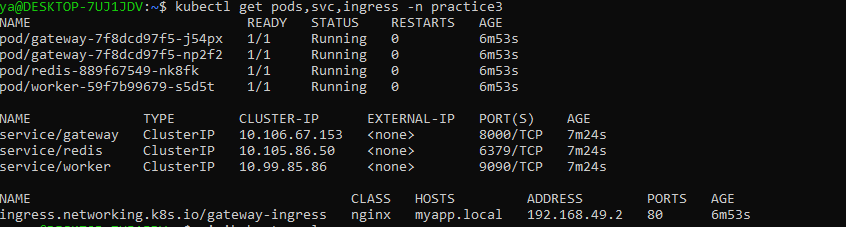
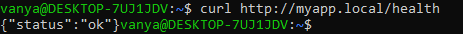
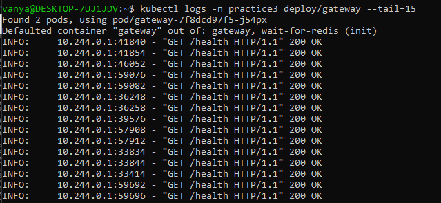
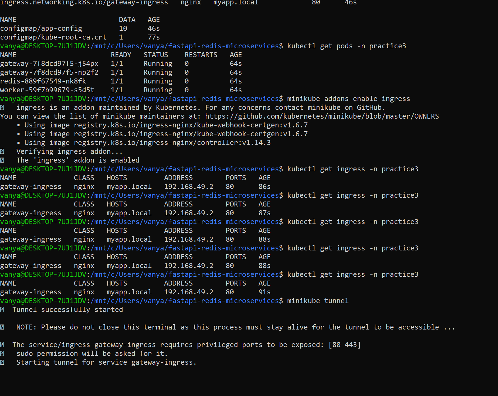

# Отчёт по практике №3 — Контейнеризация и деплой в Kubernetes

## Ссылка на репозиторий

https://github.com/BolansMura/practice2

Код микросервисов: `practice2/` · манифесты K8s: `practice3/k8s/`

---

## 1. Список микросервисов и Docker-образов

| № | Микросервис | Назначение | Docker-образ | Deployment | Service (ClusterIP) | Реплики |
|---|-------------|------------|--------------|------------|---------------------|---------|
| 1 | **redis** | Кэш результатов + очередь Redis Streams | `redis:7-alpine` | `redis` | `redis:6379` | 1 |
| 2 | **gateway** | API Gateway (FastAPI), точка входа HTTP | `practice2-gateway:latest` | `gateway` | `gateway:8000` | **2** |
| 3 | **worker** | Потребитель очереди, бизнес-логика | `practice2-worker:latest` | `worker` | `worker:9090` | 1 |

**Ingress:** `gateway-ingress` → хост `myapp.local` → Service `gateway:8000`

**Конфигурация (не в образе):**

| Объект | Файл | Содержимое |
|--------|------|------------|
| Namespace | `namespace.yaml` | `practice3` |
| ConfigMap | `configmap.yaml` | `TASK_STREAM`, `CONSUMER_GROUP`, `RETRY_*`, `RESULT_TTL_SECONDS`, `REDIS_HOST/PORT` |
| Secret | `secret.yaml` | `REDIS_URL`, `REDIS_PASSWORD` |
| PVC | `pvc-redis.yaml` | `redis-data`, 1 Gi |

**Сборка образов приложения** (контекст — каталог `practice2/`):

```bash
eval $(minikube docker-env)
docker build -t practice2-gateway:latest -f services/gateway/Dockerfile .
docker build -t practice2-worker:latest -f services/worker/Dockerfile .
```

Скрипт: `practice3/scripts/build-minikube-images.sh`  
`imagePullPolicy: IfNotPresent` — образы берутся из Docker-демона Minikube.

---

## 2. Инструкция по развёртыванию в Minikube

### Предварительные требования

- WSL (Ubuntu), Docker Desktop с интеграцией WSL
- Установлены: `docker`, `kubectl`, `minikube`

```bash
# kubectl (если нет в apt)
curl -LO "https://dl.k8s.io/release/$(curl -L -s https://dl.k8s.io/release/stable.txt)/bin/linux/amd64/kubectl"
chmod +x kubectl && sudo mv kubectl /usr/local/bin/

# minikube
curl -LO https://storage.googleapis.com/minikube/releases/latest/minikube-linux-amd64
sudo install minikube-linux-amd64 /usr/local/bin/minikube
```

### Шаг 1. Запуск кластера

```bash
minikube start --driver=docker
minikube addons enable ingress
kubectl get nodes
```

### Шаг 2. Сборка образов в Minikube

```bash
cd /mnt/c/Users/vanya/fastapi-redis-microservices
sed -i 's/\r$//' practice3/scripts/build-minikube-images.sh
bash practice3/scripts/build-minikube-images.sh
```

### Шаг 3. Деплой манифестов

```bash
kubectl apply -f practice3/k8s/
# при ошибке "namespace not found" — повторить apply один раз
kubectl get pods,svc,ingress -n practice3
```

Ожидаемые поды: `redis` ×1, `gateway` ×2, `worker` ×1 — все **Running**.

### Шаг 4. Доступ извне (Ingress)

**Терминал 1** (не закрывать):

```bash
minikube tunnel
```

При `TUNNEL_ALREADY_RUNNING` — туннель уже запущен в другом окне, второй не нужен.

**Файл hosts:**

- WSL: `echo "127.0.0.1 myapp.local" | sudo tee -a /etc/hosts`
- Windows: `C:\Windows\System32\drivers\etc\hosts` → `127.0.0.1 myapp.local`

### Шаг 5. Проверка API

```bash
curl http://myapp.local/health

curl -X POST http://myapp.local/execute \
  -H "Content-Type: application/json" \
  -H "Idempotency-Key: 550e8400-e29b-41d4-a716-446655440000" \
  -d '{"action":"process","data":{"value":1}}'
```

Повтор с тем же `Idempotency-Key` через 1–2 с → **200** и `"status":"completed"`.

### Шаг 6. Диагностика

```bash
kubectl get pods,deploy,svc,ingress -n practice3
kubectl describe pod -n practice3 -l app=gateway
kubectl logs -n practice3 deploy/gateway --tail=30
kubectl logs -n practice3 deploy/worker --tail=30
```

---

## 3. Скриншоты

Сохраните файлы в `practice3/docs/` и вставьте в отчёт (или вставьте скрины прямо в PDF).

### 3.1. Состояние кластера — `kubectl get pods,svc,ingress`

**Команда:**

```bash
kubectl get pods,svc,ingress -n practice3
```

**За что отвечает:** все Deployment подняты, Service типа ClusterIP созданы, Ingress `gateway-ingress` с хостом `myapp.local` зарегистрирован.

**Пример фактического вывода (pods):**

```text
NAME                       READY   STATUS    RESTARTS   AGE
gateway-7f8dcd97f5-j54px   1/1     Running   0          64s
gateway-7f8dcd97f5-np2f2   1/1     Running   0          64s
redis-889f67549-nk8fk      1/1     Running   0          64s
worker-59f7b99679-s5d5t    1/1     Running   0          64s
```



---

### 3.2. Успешный curl через Ingress

**Команда:**

```bash
curl -v http://myapp.local/health
```

**За что отвечает:** запрос с хоста проходит цепочку **Ingress → Service gateway → Pod gateway**; API доступен по домену `myapp.local`.

**Пример фактического вывода:**

```text
< HTTP/1.1 200 OK
< Content-Type: application/json
{"status":"ok"}
```

**POST /execute (202):**

```text
{"status":"accepted","idempotency_key":"550e8400-e29b-41d4-a716-446655440000",
 "message":"Task queued for processing"}
```



---

### 3.3. Логи одного из подов

**Команда** (аналог `kubectl logs frontend-xxx` из задания; у нас — gateway):

```bash
kubectl logs -n practice3 deploy/gateway --tail=30
```

**За что отвечает:** приложение в контейнере стартовало без фатальных ошибок (Uvicorn, обработка запросов).

Альтернатива: `kubectl logs -n practice3 deploy/worker --tail=30`



---

### 3.4. (Рекомендуется) Minikube tunnel

**За что отвечает:** проброс Ingress на `127.0.0.1:80` для доступа с рабочей станции.



---

## 4. Соответствие минимальным требованиям

| Требование | Выполнено |
|------------|-----------|
| ≥ 2 микросервиса, взаимодействие (очередь Redis Streams) | ✅ gateway + worker + redis |
| Отдельный Deployment на сервис | ✅ `deployment-*.yaml` |
| Service ClusterIP | ✅ `service-*.yaml` |
| Ingress на API Gateway | ✅ `ingress.yaml`, `myapp.local` |
| ConfigMap / Secret | ✅ `configmap.yaml`, `secret.yaml` |
| PVC | ✅ `pvc-redis.yaml` |
| Работоспособность после `kubectl apply -f k8s/` | ✅ проверено curl |

---

## 5. Дополнительные усложнения

| Усложнение | Статус | Описание |
|------------|--------|----------|
| **StatefulSet** | ❌ не реализован | Redis развёрнут как Deployment + PVC |
| **HPA** | ❌ не реализован | — |
| **Service Mesh** | ❌ не реализован | — |
| **Init-container `wait-for-redis`** | ✅ | В `deployment-gateway.yaml`, `deployment-worker.yaml` — ожидание порта 6379 перед стартом |
| **2 реплики Gateway** | ✅ | `deployment-gateway.yaml`: `replicas: 2` |
| **PersistentVolumeClaim для Redis** | ✅ | `pvc-redis.yaml` |

Дополнительные манифесты отдельно не требуются — логика в перечисленных файлах `practice3/k8s/`.

---

## 6. Использование ИИ-агентов

| Инструмент | Применение |
|------------|------------|
| **Cursor (Agent)** | Генерация YAML-манифестов (`practice3/k8s/`), `docker-compose`-логика перенесена в K8s, отчёт PRACTICE3.md |
| **Claude** (в Cursor) | Структура Deployment/Service/Ingress, ConfigMap/Secret, скрипт `build-minikube-images.sh` |

**Примеры промптов:** см. practice2; для practice3 — «Разверни микросервисы practice2 в Minikube: Deployment, Service, Ingress myapp.local, ConfigMap, Secret, PVC».

**Доработка вручную:** установка minikube/kubectl в WSL, `minikube tunnel`, `/etc/hosts`, повторный `kubectl apply`, скриншоты.

---

## 7. Чеклист сдачи

- [x] `minikube start --driver=docker` + addon `ingress`
- [x] Образы `practice2-gateway` / `practice2-worker` в Minikube
- [x] `kubectl apply -f practice3/k8s/`
- [x] Все pods `Running` в namespace `practice3`
- [x] `minikube tunnel` + `myapp.local` в hosts
- [x] `curl http://myapp.local/health` → 200
- [x] `POST /execute` → 202
- [ ] Скриншоты прикреплены в `practice3/docs/` и видны в этом файле
