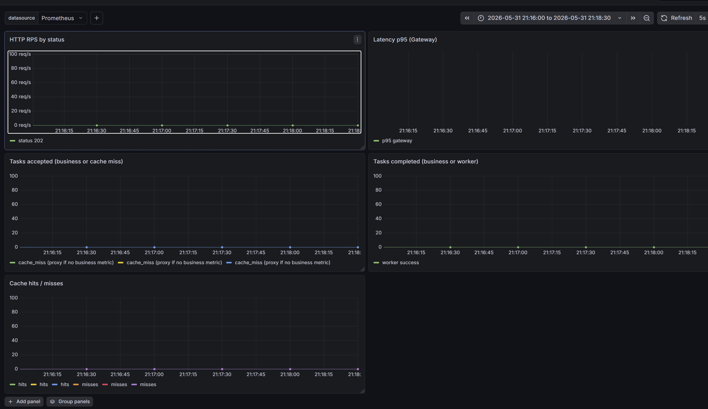
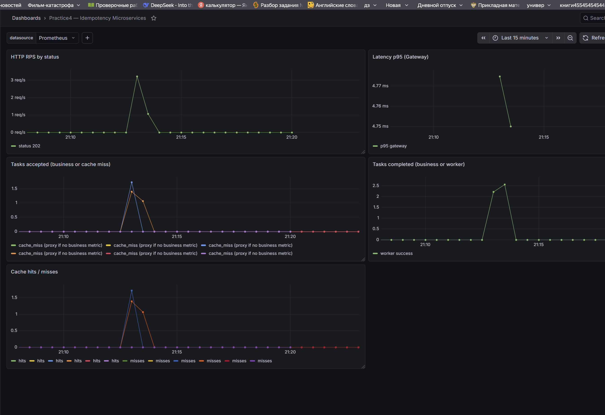
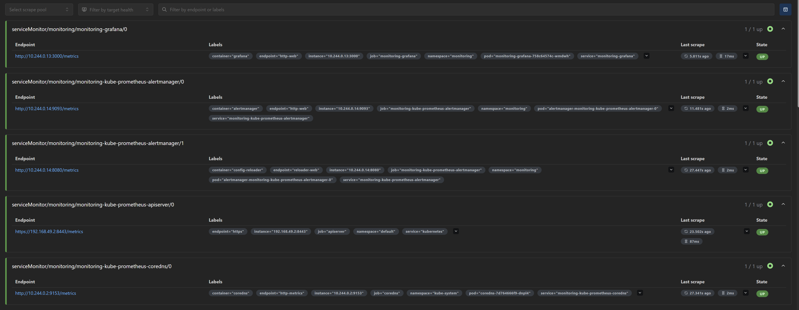

# Отчёт по практике №4 — Мониторинг и наблюдаемость

## Ссылка на репозиторий

https://github.com/BolansMura/practice2

Каталоги: `practice2/` (приложение), `practice3/k8s/` (деплой), `practice4/monitoring/` (мониторинг).

---

## 1. Выбранная система мониторинга и обоснование

**Выбрано: Prometheus + Grafana** (чарт Helm `kube-prometheus-stack`).

**Почему именно этот стек:**

1. **Совместимость с приложением** — микросервисы practice2 изначально экспортируют метрики в формате Prometheus на `/metrics` (`prometheus-client` для Python).
2. **Интеграция с Kubernetes** — оператор Prometheus поддерживает CRD **ServiceMonitor**: не нужно вручную править `prometheus.yml` при смене pod’ов.
3. **Минимальный порог входа в Minikube** — установка одной командой Helm, Grafana входит в стек.
4. **Соответствие заданию** — счётчики, гистограммы, дашборды RPS/latency/бизнес-метрик — стандартный сценарий Prometheus + Grafana.

Альтернативы (SigNoz, Victoria Metrics, Zabbix) не выбирались, чтобы не менять формат экспорта (OTLP) и не усложнять отчёт.

---

## 2. Экспортируемые метрики приложения

Все метрики отдаются в **текстовом формате Prometheus** на GET `/metrics`.

### API Gateway (порт 8000)

| Имя метрики | Тип | Лейблы | Как помогает в эксплуатации |
|-------------|-----|--------|-----------------------------|
| `http_requests_total` | Counter | `method`, `endpoint`, `status` | **Обязательная:** RPS, доля 202/200/4xx/5xx, видны всплески ошибок и 503 при падении Redis |
| `http_request_duration_seconds` | Histogram | `method`, `endpoint` | **Обязательная:** перцентили задержки (p95), деградация API под нагрузкой |
| `business_tasks_accepted_total` | Counter | `action` | **Бизнес:** число задач, принятых в очередь (ответ 202); рост = новая нагрузка |
| `cache_hits_total` | Counter | — | Повторные запросы с тем же `Idempotency-Key` (ответ 200 из кэша) |
| `cache_misses_total` | Counter | — | Новые ключи / промах кэша (ответ 202); при нагрузочном тесте с UUID ≈ proxy для «принятых задач» |

### Worker (порт 9090)

| Имя метрики | Тип | Лейблы | Как помогает в эксплуатации |
|-------------|-----|--------|-----------------------------|
| `business_tasks_completed_total` | Counter | `action` | **Бизнес:** успешно обработанные задачи |
| `worker_tasks_processed_total` | Counter | `status` | Итоги обработки: `success`, `error`, `invalid` |
| `worker_task_duration_seconds` | Histogram | — | Время обработки задачи (50–200 ms в симуляции) |
| `worker_task_retries_total` | Counter | — | Повторы при транзиентных сбоях |

> **Примечание:** метрики `business_tasks_*` добавлены в код practice2; в кластере они появятся после пересборки образов. До пересборки для мониторинга потока задач использовались `cache_misses_total` (gateway) и `worker_tasks_processed_total{status="success"}` (worker).

---

## 3. Настройка сбора метрик

Использован способ из задания: **Prometheus Operator + ServiceMonitor** (не статический `scrape_configs` и не OpenTelemetry).

### 3.1. Установка стека

```bash
helm repo add prometheus-community https://prometheus-community.github.io/helm-charts
helm upgrade --install monitoring prometheus-community/kube-prometheus-stack \
  --namespace monitoring \
  --create-namespace \
  --set prometheus.prometheusSpec.serviceMonitorSelectorNilUsesHelmValues=false
```

Скрипт: `practice4/monitoring/helm-install.sh`  
Результат: `STATUS: deployed`, namespace `monitoring`.

### 3.2. ServiceMonitor для приложения

| Файл | Service | Namespace | Port | Path | Interval |
|------|---------|-----------|------|------|----------|
| `servicemonitor-gateway.yaml` | `gateway` | `practice3` | `http` (8000) | `/metrics` | 15s |
| `servicemonitor-worker.yaml` | `worker` | `practice3` | `metrics` (9090) | `/metrics` | 15s |

Метка `release: monitoring` — связь с Helm release.

```bash
kubectl apply -f practice4/monitoring/servicemonitor-gateway.yaml
kubectl apply -f practice4/monitoring/servicemonitor-worker.yaml
```

Prometheus автоматически обнаруживает endpoints через Kubernetes API. Дополнительная правка ConfigMap Prometheus **не потребовалась**.

### 3.3. ConfigMap и Secret приложения

Конфигурация runtime (не мониторинг, но в том же кластере): `practice3/k8s/configmap.yaml`, `secret.yaml` — переменные `REDIS_URL`, параметры очереди.

### 3.4. Проверка сбора

- Prometheus UI: `kubectl port-forward -n monitoring svc/monitoring-kube-prometheus-prometheus 9091:9090`
- Targets: `serviceMonitor/practice3/gateway/0` и `.../worker/0` — **UP**
- Ошибки scrape control plane (`192.168.49.2:10257`, etcd) в Minikube — **ожидаемы**, на приложение не влияют

---

## 4. Дашборд Grafana и скриншоты

Импорт: `practice4/monitoring/grafana-dashboard-idempotency.json`  
Доступ: `kubectl port-forward -n monitoring svc/monitoring-grafana 3000:80` → http://localhost:3000

### 4.1. Пояснение панелей

| № | Панель на дашборде | PromQL (суть) | Что видно на скриншоте |
|---|-------------------|---------------|-------------------------|
| 1 | **HTTP RPS by status** | `sum(rate(http_requests_total{namespace="practice3",pod=~"gateway.*"}[1m])) by (status)` | Общая нагрузка на API; при load-test рост линий, в т.ч. `202` |
| 2 | **Latency p95 (Gateway)** | `histogram_quantile(0.95, sum(rate(http_request_duration_seconds_bucket{...}[1m])) by (le))` | 95-й перцентиль времени ответа; растёт при одновременных запросах к Redis |
| 3 | **Tasks accepted** | `business_tasks_accepted_total` или **`rate(cache_misses_total[1m])`** | Скорость «новых» задач; при тесте с уникальными ключами — **cache_miss ≈ 1.4/s** |
| 4 | **Tasks completed** | `business_tasks_completed_total` или **`worker_tasks_processed_total{status="success"}`** | Скорость успешной обработки worker (с лагом ~100–200 ms) |
| 5 | **Cache hits / misses** | `rate(cache_hits_total[1m])`, `rate(cache_misses_total[1m])` | Идемпотентность: при UUID-only нагрузке доминируют **misses** |

### 4.2. Ссылки на скриншоты

| Файл | Описание |
|------|----------|
| [screenshots/01-grafana-before-load.png](screenshots/01-grafana-before-load.png) | Дашборд до нагрузки: низкий RPS, метрики у baseline |
| [screenshots/02-grafana-under-load.png](screenshots/02-grafana-under-load.png) | Дашборд во время/после `load-test.sh`: рост **cache_misses** (~1.39/s), активность на панелях нагрузки |
| [screenshots/03-prometheus-targets.png](screenshots/03-prometheus-targets.png) | Prometheus → Targets: endpoints gateway/worker в состоянии **UP** |







---

## 5. Результаты нагрузочного теста

**Сценарий:**

```bash
# Предусловия: minikube tunnel, 127.0.0.1 myapp.local в hosts, practice3 Running
bash practice4/scripts/load-test.sh   # COUNT=150, уникальный Idempotency-Key на запрос
```

**Наблюдения на дашборде (Grafana, окно Last 15 min):**

| Метрика / панель | До нагрузки | Во время / после нагрузки | Интерпретация |
|------------------|-------------|---------------------------|---------------|
| HTTP RPS (`http_requests_total`) | ≈ 0 req/s | Кратковременный рост | 150 POST `/execute` за короткий интервал |
| Latency p95 | близко к нулю | небольшой подъём | Доп. задержка Redis + сериализация JSON |
| **Cache misses** | ≈ 0 | **~1.39 /s** | Каждый запрос с новым ключом → 202, промах кэша |
| Cache hits | ≈ 0 | ≈ 0 | Уникальные ключи → попаданий нет |
| Worker success rate | ≈ 0 | рост следом за misses | Worker обрабатывает очередь с задержкой 50–200 ms |
| `business_tasks_*` | No data* | No data* | *Образы с новыми метриками не пересобраны (таймаут Docker Hub) |

**Вывод по нагрузке:** рост **RPS** и **cache_misses** подтверждает, что Prometheus собирает метрики приложения в реальном времени; связка Gateway → Redis → Worker отражается на графиках. После остановки скрипта значения `rate()` снижаются — нормальное поведение counter-метрик.

**Дополнительная проверка (повтор ключа):** два запроса с одним `Idempotency-Key` дают рост **cache_hits** и ответ 200 — идемпотентность видна на панели 5.

---

## 6. Вывод о пользе мониторинга для эксплуатации микросервисов

1. **Быстрая диагностика** — по `http_requests_total{status="503"}` видно проблемы Redis до анализа логов; по падению `worker_tasks_processed_total{status="success"}` — сбой worker/очереди.
2. **Бизнес-контекст** — счётчики принятых/завершённых задач (или proxy `cache_miss` / worker success) показывают, обрабатывает ли система нагрузку, а не только «жив ли pod».
3. **Идемпотентность** — соотношение hits/misses показывает, работает ли кэш и не дублируется ли работа.
4. **Планирование capacity** — p95 latency и RPS при load-test дают ориентир для масштабирования реплик Gateway (2) и Worker.
5. **Связь с деплоем** — сравнение дашборда до/после `kubectl rollout` выявляет регрессии релиза.

Без мониторинга в Kubernetes остаются только `kubectl logs` и ручные `curl`; при 2 репликах gateway и асинхронной очереди это не масштабируется. Prometheus + Grafana + ServiceMonitor дают единую картину для practice2/practice3 в Minikube.

---

## 7. Использование ИИ

**Cursor Agent** — Helm-скрипт, ServiceMonitor, дашборд JSON, бизнес-метрики в коде, отчёт PRACTICE4.md.  
**Вручную** — установка minikube/kubectl/helm, port-forward, load-test, скриншоты, правка PromQL (`[1m]` в `rate()`).

---

## 8. Чеклист сдачи

- [x] Prometheus + Grafana (`kube-prometheus-stack`) в namespace `monitoring`
- [x] ServiceMonitor для gateway и worker
- [x] Targets приложения UP
- [x] Дашборд Grafana импортирован
- [x] Нагрузочный тест `load-test.sh` (150 запросов)
- [x] Скриншоты в `practice4/screenshots/` (3 шт.)
- [ ] Пересборка образов с `business_tasks_*` (опционально, при доступе к Docker Hub)
